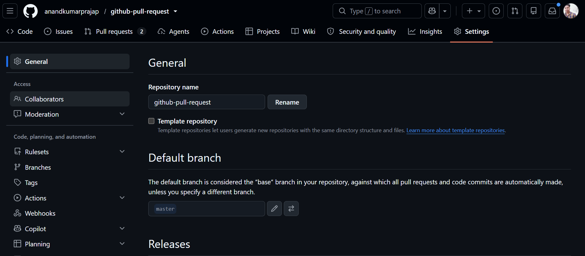
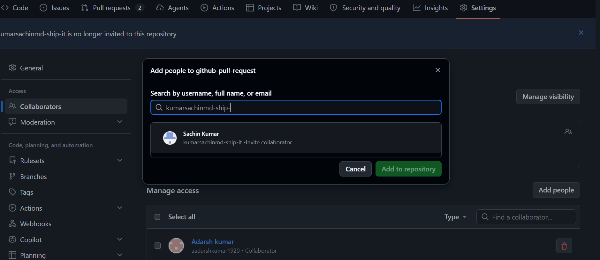
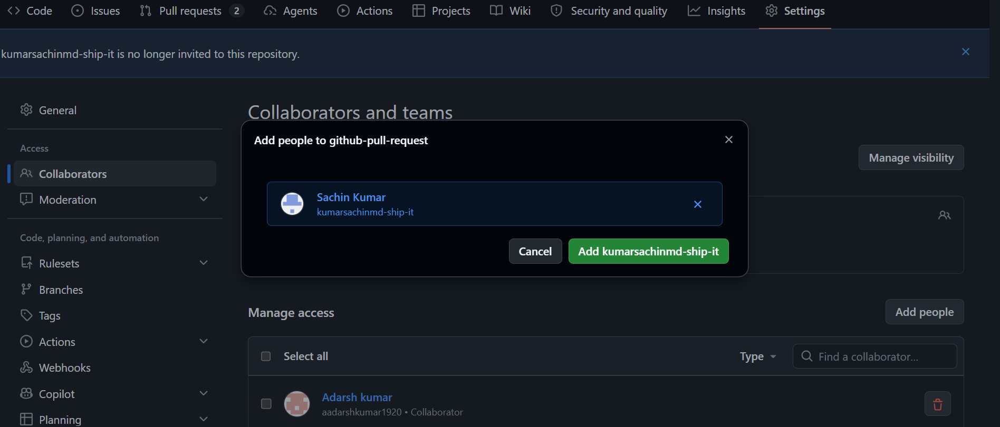
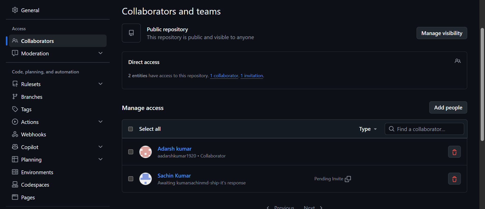
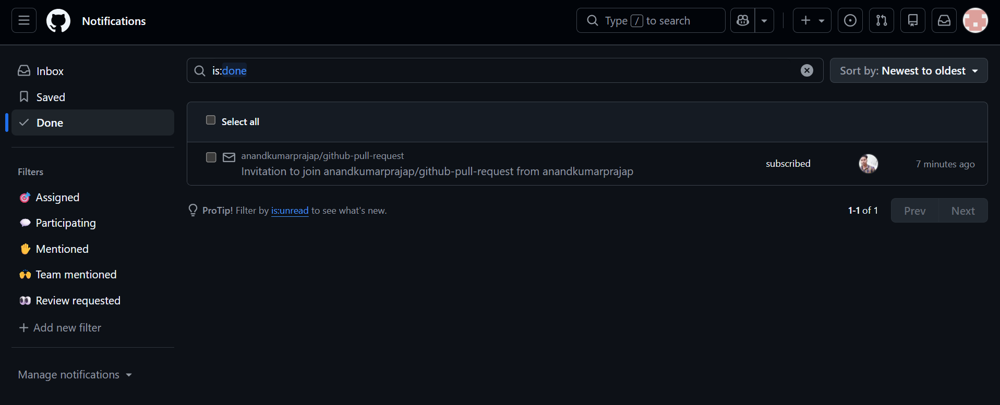
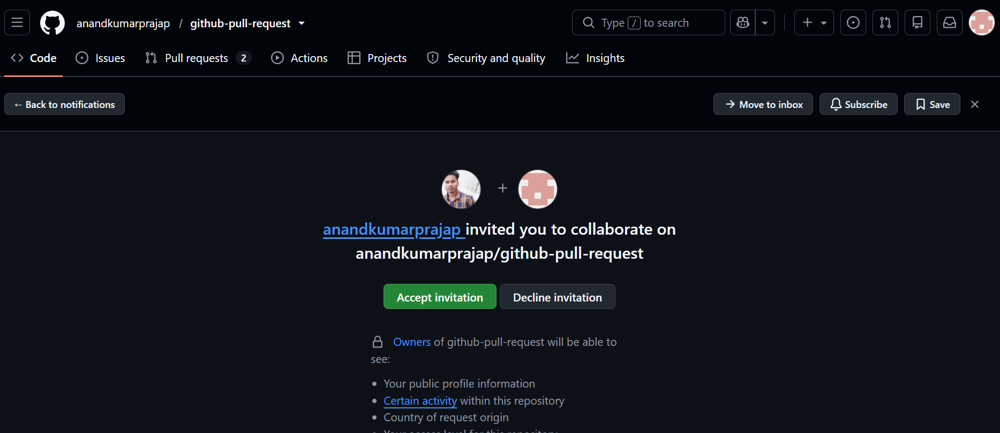
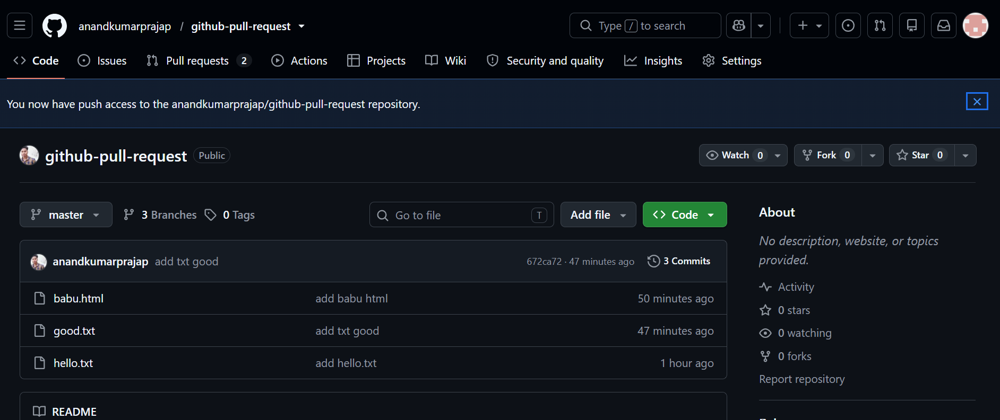

### 🤝 How to Grant Repository Access to your Developer

Follow these simple steps to add **`aadarshkumar1920`** to your repository as a collaborator.

#### 🛠️ Step-by-Step Instructions

**As `anandkumarprajap`:**

* **Open your repository:** Navigate to the main page of the GitHub repository you want to share.
* **Open Settings:** Click on the **Settings** gear icon tab located in the top menu bar.
* **Manage Access:** In the left sidebar navigation, click on **Collaborators** (or **Collaborators and teams** under the *Access* section).
* **Add Developer:** Click the green **Add people** button.
* **Search Username:** Type **`aadarshkumar1920`** into the search field and select their profile.
* **Send Invitation:** Click **Add aadarshkumar1920 to this repository** to dispatch the invite.

***

#### 📨 Finalizing the Setup

* **Accept the Invite:** Have the developer log into the **`aadarshkumar1920`** GitHub account to accept the invitation via email or their GitHub dashboard notifications.

✨ **Success!** Once accepted, your developer will officially have push/pull write access to start working on the project.

